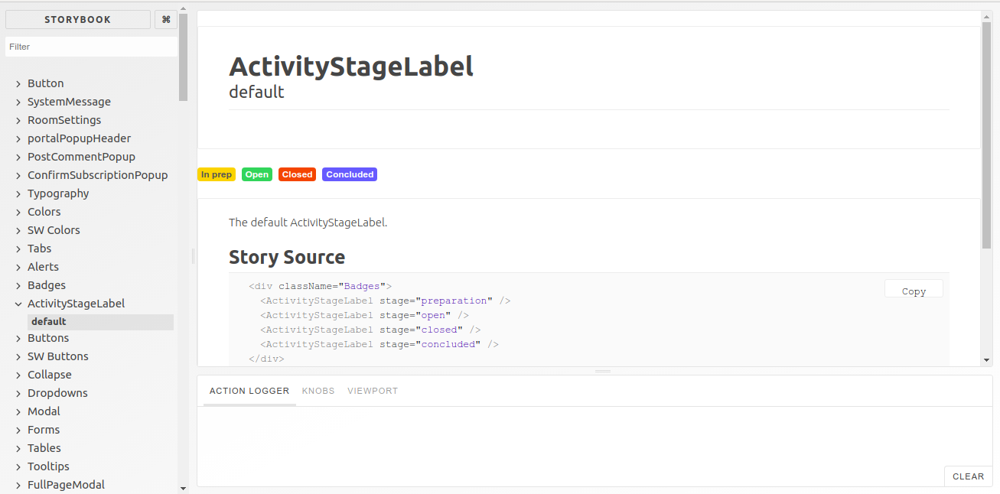

# Stickyworld

Stickyworld is a platform that helps you engage with your clients and team to exchange ideas, discuss and consult on proposals, review project progress & record decisions together. 
 
In which I created Bootstrap 4 based reusable components using ReactJs and SCSS. 
 
And demonstrated this component using storyBookJs. This components are cross Browser compatible.

### ScreenShot:-

